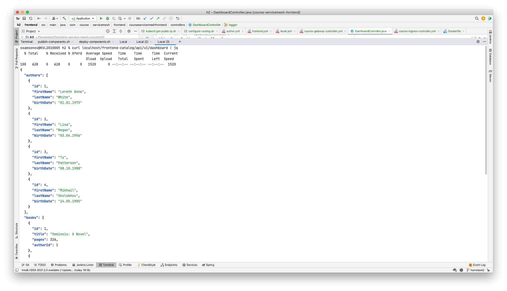
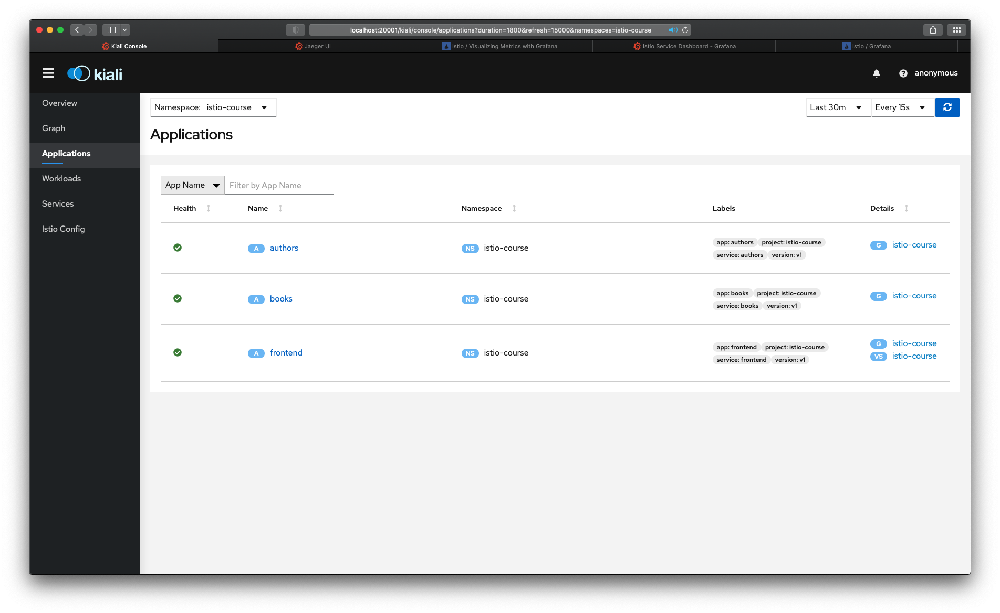
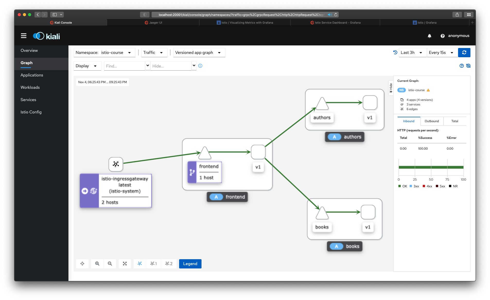
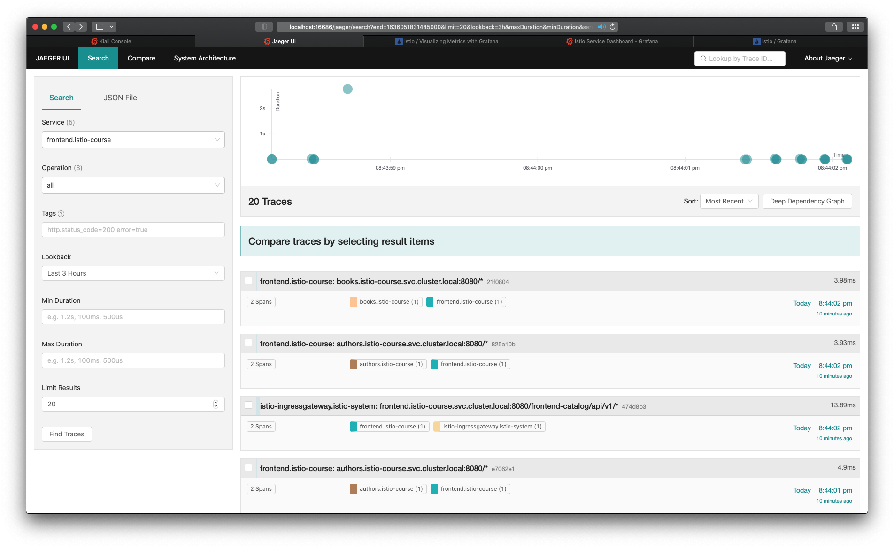
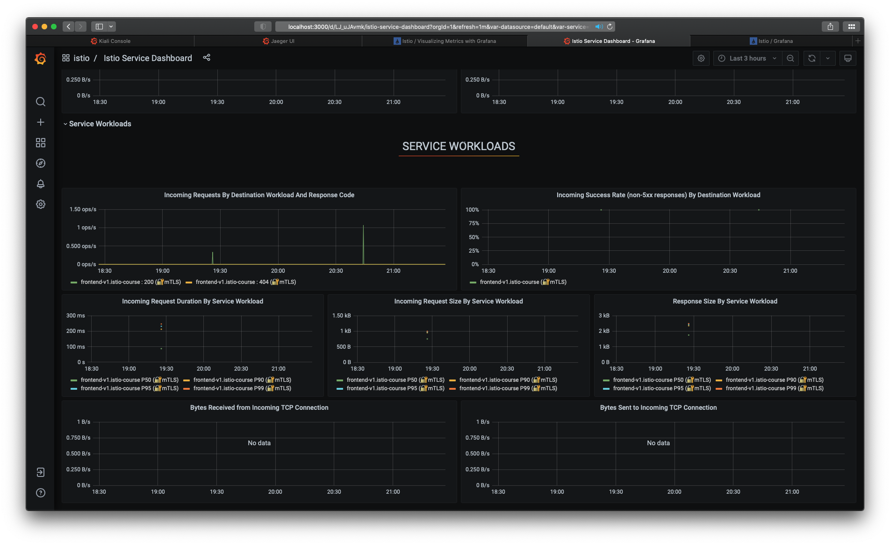
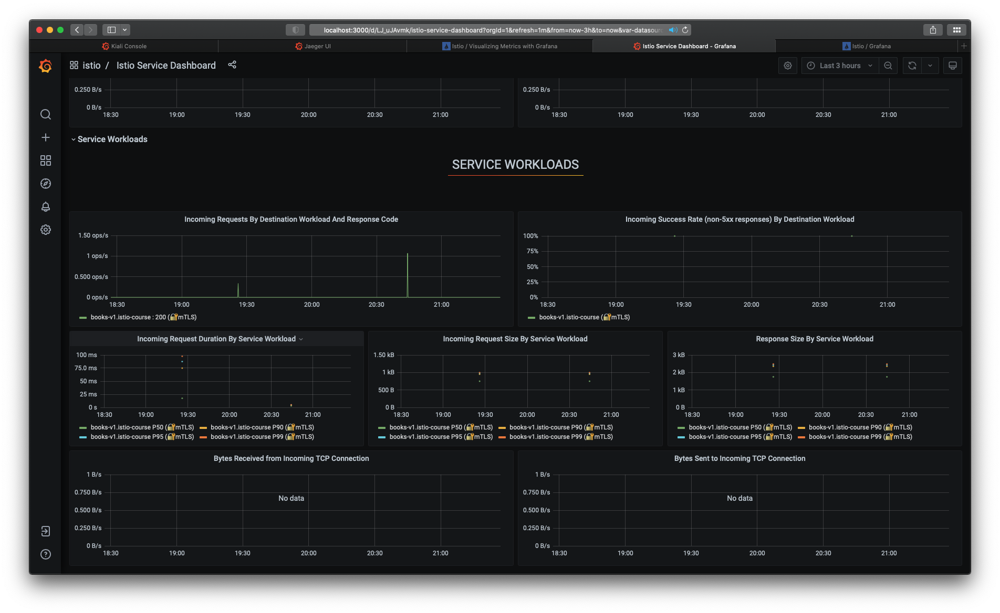
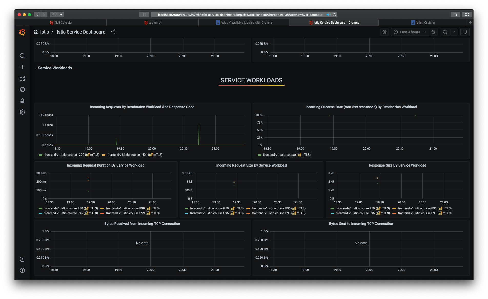

## Application deployment and telemetry data

1. [Prerequisites](#Prerequisites)
1. [Build services](#Build services)
1. [Publish demo application to DockerHub](#Publish demo application to DockerHub)
1. [Deploy applications to k8s](#Deploy applications to k8s)
1. [Query application](#Query application)
1. [Kiali](#Kiali)
1. [Jaeger](#Jaeger)
1. [Grafana](#Grafana)

<a name="Prerequisites"></a>
### Prerequisites
Have JDK11 and maven installed.

<a name="Build services"></a>
### Build services
`./scripts/build-components.sh`

<a name="Publish demo application to DockerHub"></a>
### Publish demo application to DockerHub

`./scripts/publish-components.sh` (make sure to edit script to point it to your personal DockerHub repo)

<a name="Deploy applications to k8s"></a>
### Deploy applications to k8s
Make sure to edit the following files to point them to your personal DockerHub repo first:
- Frontend: `k8s/deployments/frontend.yml`
- Book service: `k8s/deployments/book.yml`
- Author service: `k8s/deployments/author.yml`

Then run the deployment script: `./scripts/deploy-components.sh`

And another script to create an ingress controller and gateway: `./scripts/configure-routing.sh`

<a name="Query application"></a>
### Query application
Query your application, e.g.:
```
export MY_APP_HOST=$(kubectl -n istio-course get ingress -o=jsonpath='{.items[].status.loadBalancer.ingress[].hostname}')
curl $MY_APP_HOST/frontend-catalog/api/v1/dashboard
```


<a name="Kiali"></a>
### Kiali
Check out your Kiali dashboard

`istioctl dashboard kiali`



<a name="Jaeger"></a>
### Jaeger
Check out your Jaeger dashboard

`istioctl dashboard jaeger`


<a name="Grafana"></a>
### Grafana
Make sure you've actually installed Grafana dashboard for Istio:

`kubectl apply -f https://raw.githubusercontent.com/istio/istio/release-1.11/samples/addons/grafana.yaml`

Check out your Grafana dashboard

`istioctl dashboard grafana`


