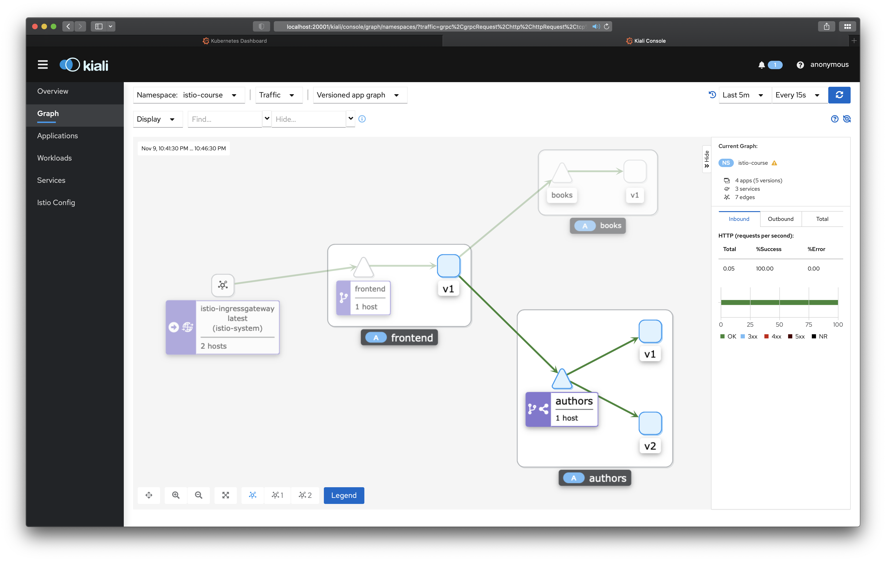
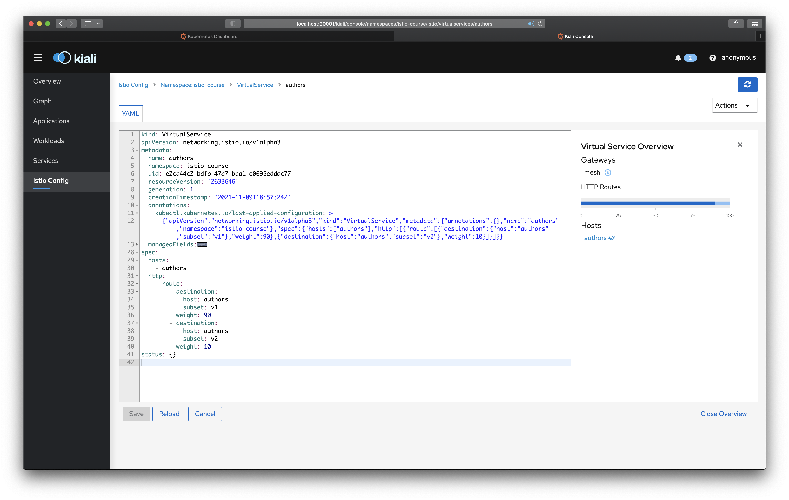
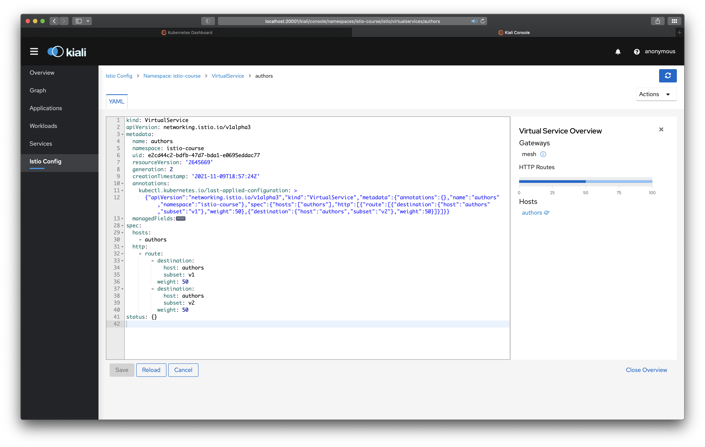
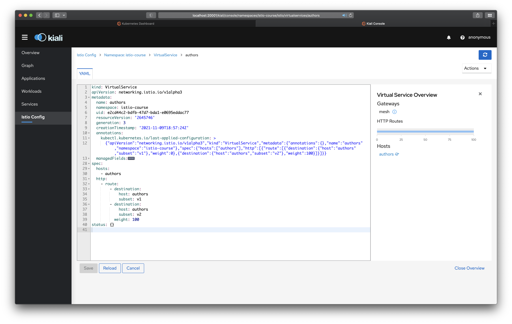
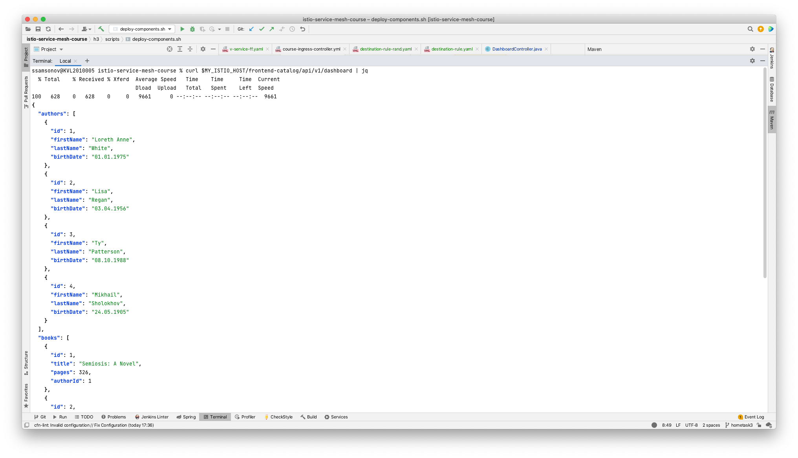
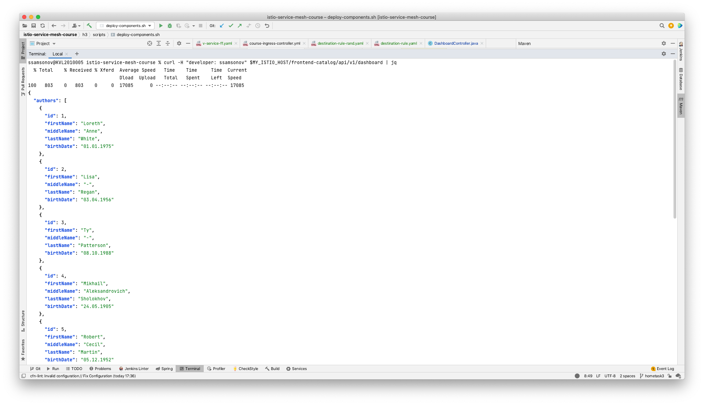
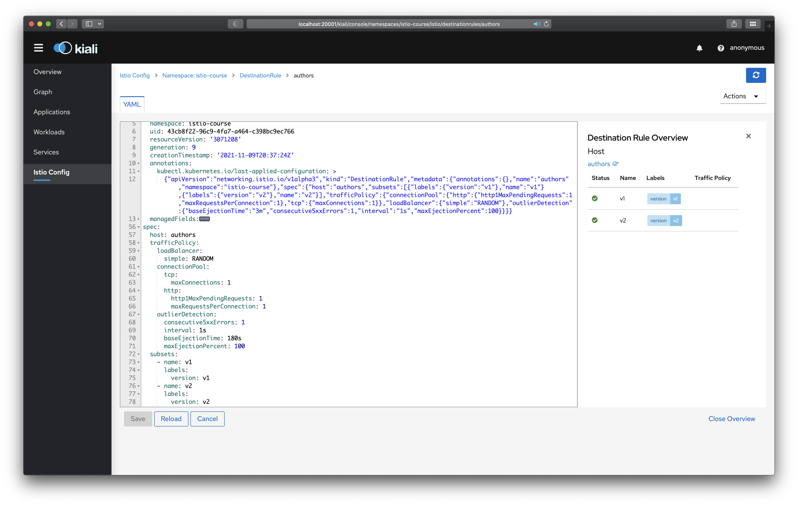

## Application deployment and telemetry data

1. [Prerequisites](#Prerequisites)
    - [Build services](#buildServices)
    - [Publish demo application to DockerHub](#dockerhub)
    - [Deploy applications to k8s](#deploy-k8s)
1. [Canary deployment](#canary)
1. [Developer environment](#dev-env)
1. [Service resiliency](#resiliency)

### Prerequisites
See [hometask 2](../h2/README.md)

### Build services
`./scripts/build-components.sh`

Please note that we've changed frontend and authors services only.

### Publish demo application to DockerHub

`./scripts/publish-components.sh` (make sure to edit script to point it to your personal DockerHub repo)

Please note that authors service is published as v2

### Deploy applications to k8s
Make sure to edit the following files to point them to your personal DockerHub repo first:
- Author service: `k8s/deployments/author.yml` (also make sure to specify v2)

Then run the deployment script: `./scripts/deploy-components.sh`

### Canary deployment

90-10 distribution:

50-50 distribution:

0-100 distribution:

### Development environment
Feature flag with "developer: ssamsonov" header.

Sending request without headers (landing on a v1)

Sending request with an appropriate header (landing on a v2 now)

### Service resiliency

Destination rule with ROUND ROBIN strategy and circuit breaking:

Destination rule with RANDOM strategy and circuit breaking:
