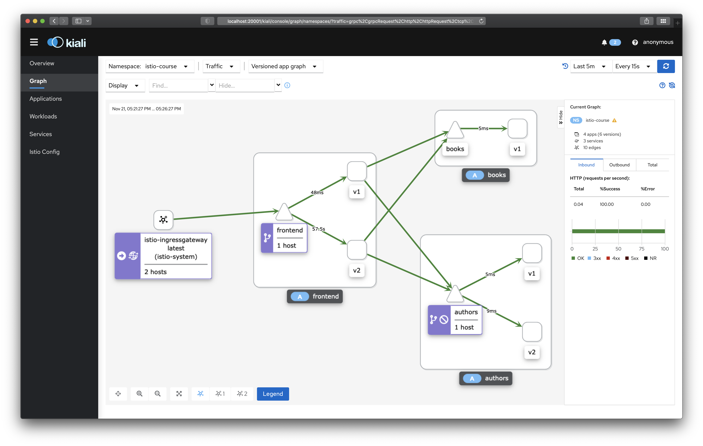
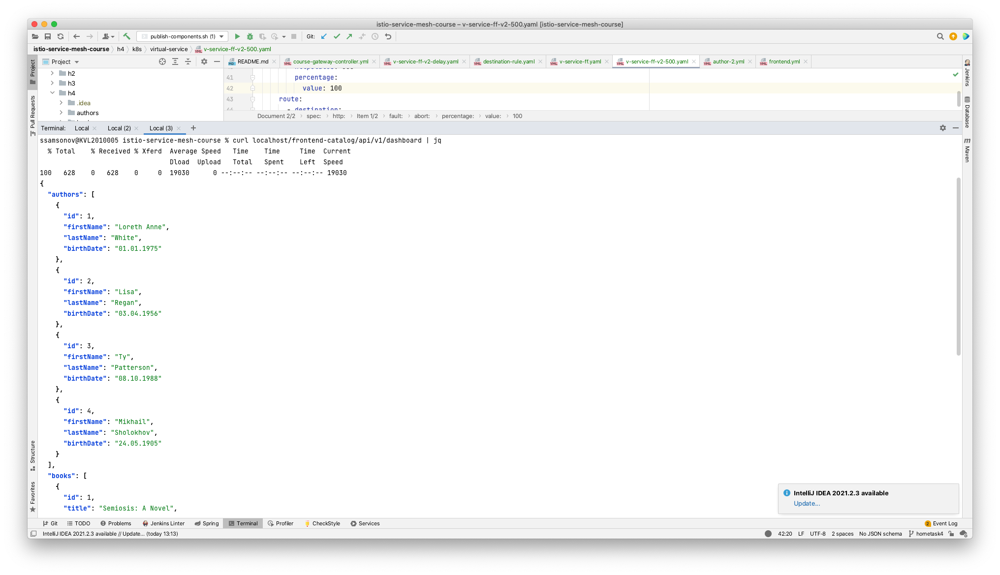
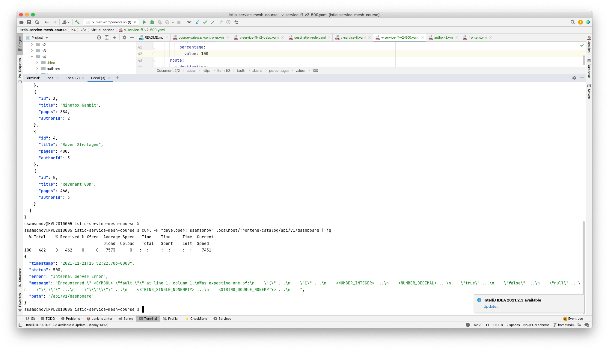

## Application deployment and telemetry data

1. [Prerequisites](#Prerequisites)
1. [Fault testing: delay](#delay)
1. [Fault testing: HTTP 500](#http500)

<a name="Prerequisites"></a>
### Prerequisites
See [hometask 3](../h3/README.md)

<a name="delay"></a>
### Fault testing: delay
Delay testing implemented via feature-flag (see [v-service-ff-v2-delay.yaml](k8s/virtual-service/v-service-ff-v2-delay.yaml))
```yaml
apiVersion: networking.istio.io/v1alpha3
kind: VirtualService
metadata:
  name: frontend
  namespace: istio-course
spec:
  hosts:
    - frontend
  http:
    - match:
      - headers:
          developer:
            exact: ssamsonov
      route:
      - destination:
          host: frontend
          subset: v2
    - route:
      - destination:
          host: frontend
          subset: v1

---

apiVersion: networking.istio.io/v1alpha3
kind: VirtualService
metadata:
  name: authors
  namespace: istio-course
spec:
  hosts:
    - authors
  http:
    - match:
        - headers:
            developer:
              exact: ssamsonov
      fault:
        delay:
          fixedDelay: 40s
          percent: 100
      route:
        - destination:
            host: authors
            subset: v2
    - route:
        - destination:
            host: authors
            subset: v1

```


<a name="http500"></a>
### Fault testing: HTTP 500
Delay testing implemented via feature-flag (see [v-service-ff-v2-500.yaml](k8s/virtual-service/v-service-ff-v2-500.yaml))
```yaml
apiVersion: networking.istio.io/v1alpha3
kind: VirtualService
metadata:
  name: frontend
  namespace: istio-course
spec:
  hosts:
    - frontend
  http:
    - match:
      - headers:
          developer:
            exact: ssamsonov
      route:
      - destination:
          host: frontend
          subset: v2
    - route:
      - destination:
          host: frontend
          subset: v1

---

apiVersion: networking.istio.io/v1alpha3
kind: VirtualService
metadata:
  name: authors
  namespace: istio-course
spec:
  hosts:
    - authors
  http:
    - match:
        - headers:
            developer:
              exact: ssamsonov
      fault:
        abort:
          httpStatus: 500
          percentage:
            value: 100
      route:
        - destination:
            host: authors
            subset: v2
    - route:
        - destination:
            host: authors
            subset: v1
```


