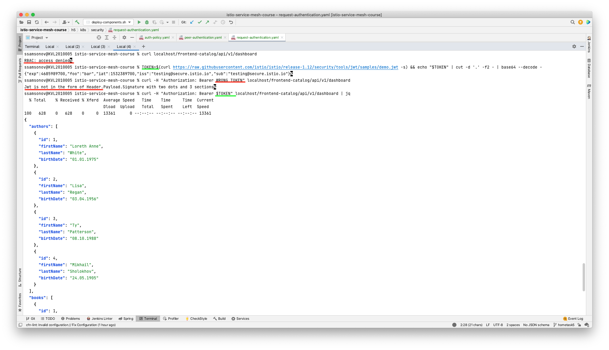
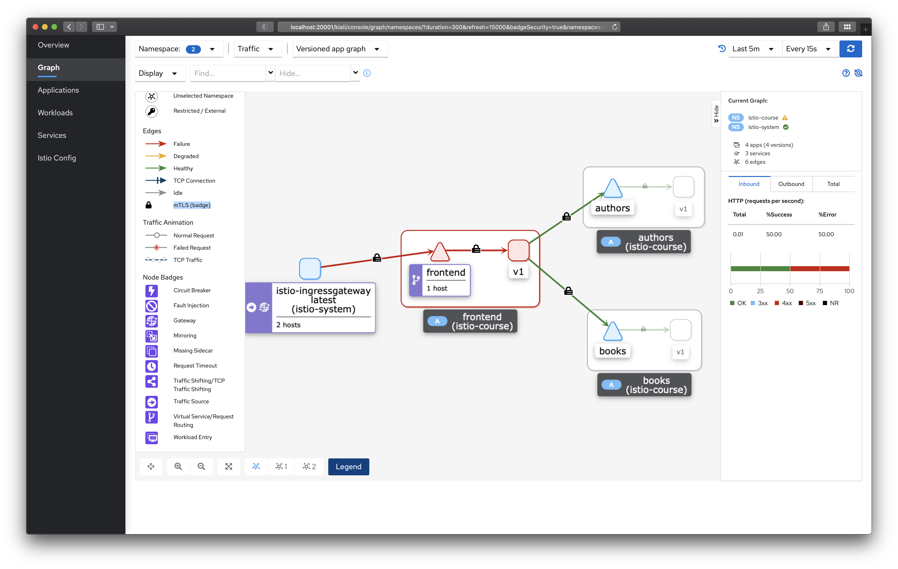

## Application deployment and telemetry data

1. [Prerequisites](#Prerequisites)
1. [Security: OAuth](#oauth)
1. [Security: mTLS](#mTLS)
   
<a name="Prerequisites"></a>
### Prerequisites
See [hometask 2](../h2/README.md)

<a name="oauth"></a>
### Security: OAuth
First apply these configs:
- [auth-policy.yaml](k8s/security/auth-policy.yaml)
- [request-authentication.yaml](k8s/security/request-authentication.yaml)

This will ensure a check on authentication for all requests and provide rules to check authentication via JWT respectively. 

Now let's try to check that it all works.

- Retrieve bearer token like this:
`TOKEN=$(curl https://raw.githubusercontent.com/istio/istio/release-1.12/security/tools/jwt/samples/demo.jwt -s)
- Try calling frontend application without a token:
  ```
        export MY_APP_HOST=$(kubectl -n istio-course get ingress -o=jsonpath='{.items[].status.loadBalancer.ingress[].hostname}')
        curl $MY_APP_HOST/frontend-catalog/api/v1/dashboard
  ```
- Try calling frontend application with a wrong token: `curl -H "Authorization: Bearer WRONG_TOKEN" $MY_APP_HOST/frontend-catalog/api/v1/dashboard`
- Try calling frontend application with a correct token: `curl -H "Authorization: Bearer $TOKEN" $MY_APP_HOST/frontend-catalog/api/v1/dashboard`


See results of these calls below:


<a name="mTLS"></a>
### Security: mTLS
We can enable mTLS with [peer-authentication.yaml](k8s/security/peer-authentication.yaml) config.

Now when we look at graph we can see small lock icons (mTLS badges) on connections between services and applications:

